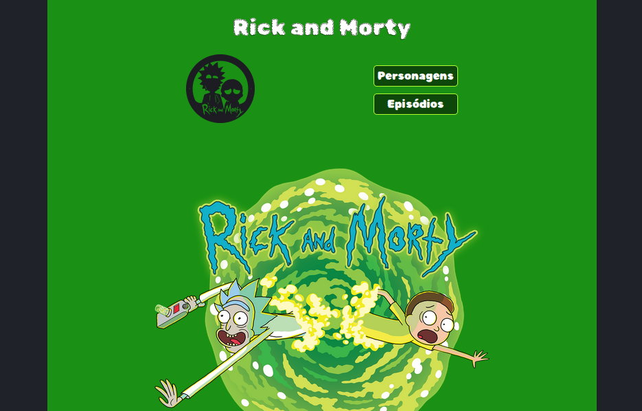

<h1 align="center">Rick and Morty</h1>

  

  <h2>Descrição do Projeto</h2>
  

    Projeto desenvolvido para disciplina de Gerência de Configuração e Mudanças do curso de Análise e Desenvolvimento de Sistemas do Instituto Federal de Educação, Ciência e Tecnologia da Paraíba Campus Cajazeiras. Trata-se de uma aplicação web para visualizar personagens e episodios da serie Rick and Morty.
  

  <h2>Status do Projeto</h2>
  
Concluído

  <h2>:man_mechanic: Linguagens e Ferramentas Utilizadas</h2>

  
- HTML
- CSS
- Javascript
- Vscode
- Live Server
- Git
<h2> :technologist:  Autores</h2>
  <table >
  <tbody>
    <tr>
      <td align="center" valign="top" width="35%">
        <a href="https://github.com/ericksjp">
          
           
          
            <b>Erick Ribeiro de Sousa</b>
          
        </a>
      </td>
      <td align="center" valign="top" width="35%" >
        <a href="https://github.com/tassomoreira">
          
           
          
            <b>Tasso Moreira de Oliveira</b>
          
        </a>
      </td>
        <td align="center" valign="top" width="35%">
        <a href="https://github.com/GerlandioBernardo">
          
           
          
            <b>Gerlândio da Silva Bernardo</b>
          
        </a>
      </td>
    </tr>
  </tbody>
</table>
 

